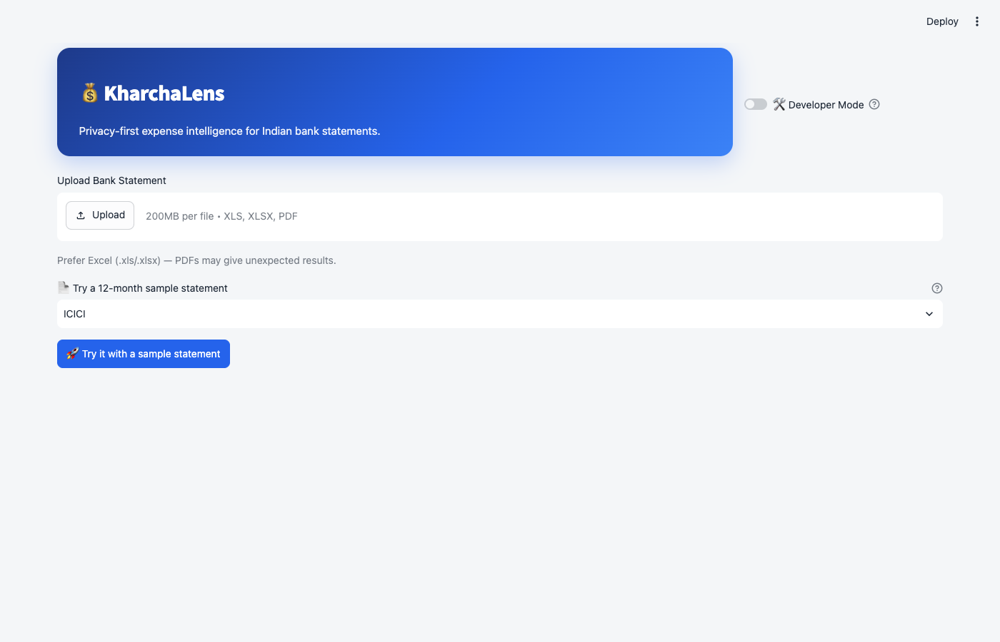
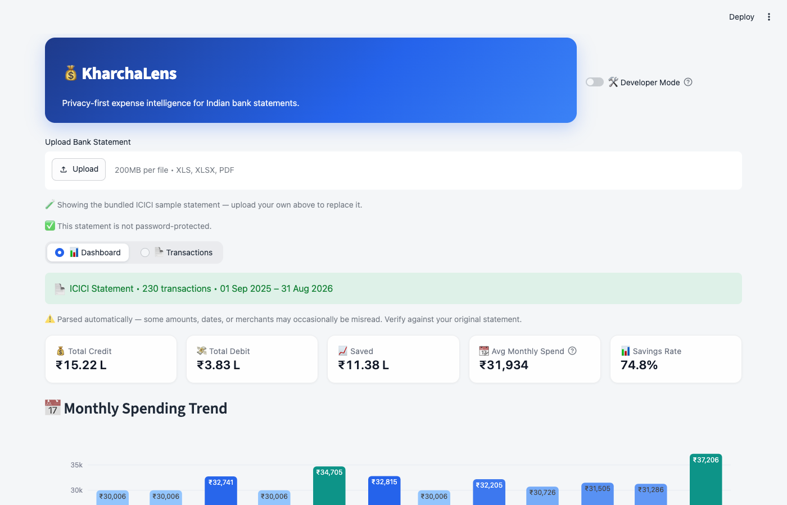
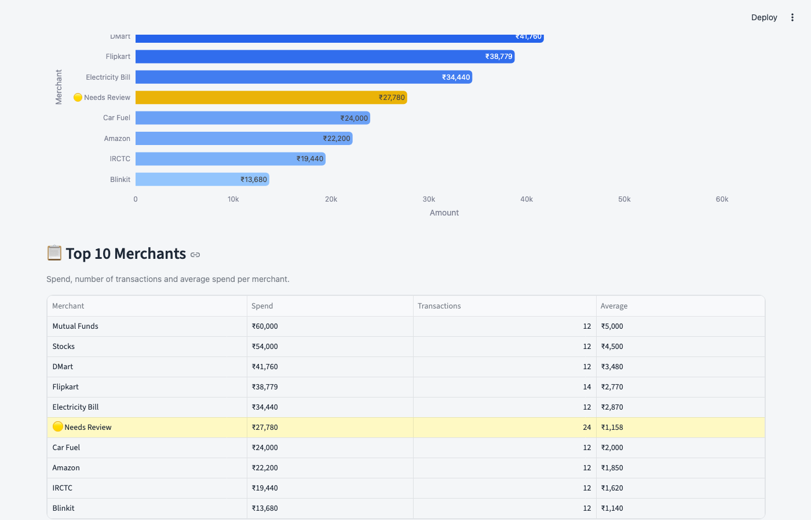
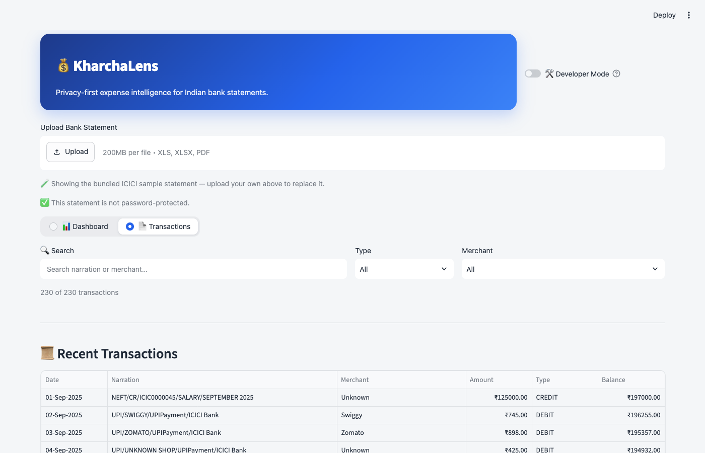

# KharchaLens 💰

*Understand your spending. Protect your privacy.*

KharchaLens is a **privacy-first, offline personal finance analyzer** for your **ICICI, HDFC, and SBI bank statements** (`.xls` / `.xlsx` / `.pdf`). Upload, parse, and get one clear answer:

> **Where did my money go?**

Everything runs **entirely on your computer** — no account, no cloud, no tracking. Your statements never leave your device.


---

## Table of Contents

- [Features](#features)
- [Screenshots](#screenshots)
- [Supported Statements](#supported-statements)
- [Getting Started](#getting-started)
  - [Prerequisites](#prerequisites)
  - [Run the app](#run-the-app)
  - [Import a statement](#import-a-statement)
- [Your Merchant Rules](#your-merchant-rules)
- [Tech Stack](#tech-stack)
- [Project Structure](#project-structure)
- [Development](#development)
- [Contributing](#contributing)
- [Security](#security)
- [License](#license)

---

## Features

- **📊 Spending Dashboard** — total credit, total debit, savings, savings rate, and average monthly spend at a glance.
- **📅 Monthly Spending Trend** — see how your spending shifts month to month.
- **🏪 Merchant Detection** — automatic recognition of common merchants (Zomato, Swiggy, Amazon, …) with ranked Top Merchants and a full spend / average / transaction summary.
- **🧾 Category Breakdown** — Lifestyle Spending, Investment, Family/Self Transfers, Insurance, Cash Withdrawal, and more.
- **💡 Highlights** — top merchant, top category, savings rate, and statement period.
- **📄 Transactions** — browse every dated transaction (narration, merchant, amount, balance).
- **🛠 Developer Mode** — merchant-coverage metrics plus a review screen for unknown spending.
- **🔒 Password support** — password-protected PDFs and encrypted Excel files.
- **🚀 Sample statements** — click **Try it with a sample statement** on the landing screen and pick an **ICICI** or **HDFC** format; the bundled twelve-month statements (230 transactions each) show the full dashboard without uploading anything.

**Recognize your own merchants.** Unrecognized entries appear as **🟡 Needs Review**. Flip on Developer Mode, pick **Add new merchant…**, type a keyword and merchant name — choose **Local** (only you, saved to `local_data/merchants.local.yml`) or **Public** (saved to `kharchalens/config/merchants.yml`, benefits everyone). Matching transactions are recognized on the next import.

---

## Screenshots

<p float="left">
  
  
</p>
<p float="left">
  
  
</p>

---

## Supported Statements

- **HDFC**, **SBI**, and **ICICI** e-statements in `.xls`, `.xlsx`, or `.pdf` — the bank is detected automatically.
- **Password-protected PDFs** and **encrypted Excel** files are supported — enter the password in the **Statement Password** field.
- ⚠️ **Prefer Excel (`.xls`/`.xlsx`)** — PDFs can give unexpected results for unusual layouts.

> Not affiliated with or endorsed by HDFC, ICICI, or SBI Bank. Always review sensitive statements before sharing them.

---

## Getting Started

### Prerequisites

- [uv](https://docs.astral.sh/uv/) — installs and manages Python 3.14 for you.
- A modern browser (macOS / Linux / Windows).

### Run the app

```bash
git clone https://github.com/aakraj/kharchalens.git
cd kharchalens
uv sync          # first time only — install deps into .venv
uv run streamlit run app.py
```

> ⚠️ Run `streamlit` from the **repository root** — merchant rules are resolved relative to the current working directory.

Open the URL Streamlit prints (usually `http://localhost:8501`).

### Import a statement

1. Click **Upload Bank Statement** and pick a `.xls`, `.xlsx`, or `.pdf` file.
2. For a password‑protected PDF or encrypted Excel file, enter its password in the **Statement Password** field.
3. Explore the Dashboard, Top Merchants, Categories, and Transactions.

> No statement handy? Click **🚀 Try it with a sample statement** first and pick **ICICI** or **HDFC** — the bundled twelve-month samples (`kharchalens/sample_data/sample_statement_icici.xlsx` / `sample_statement_hdfc.xlsx`) show the full dashboard instantly and can be regenerated with `uv run python scripts/generate_sample_statement.py`.

---

## Your Merchant Rules

Rules are simple YAML. **Recognized** merchants ship with the app in `kharchalens/config/merchants.yml`; **your personal** rules live in the gitignored `local_data/merchants.local.yml`. Developer Mode is the easiest way to add them — [see Features](#features).

Each rule maps a merchant name to a list of `contains` keywords matched against the normalized narration:

```yaml
rules:
  - merchant: Your Coffee Shop
    contains:
      - COFFEE
      - CUPJOE
```

A transaction narration is normalized (uppercased, whitespace collapsed), then matched **word-by-word** against each keyword — so `CUPJOE` won't match inside `NOTACUPJOE`. The first matching rule wins; unmatched transactions resolve to **Unknown** and appear under 🟡 **Needs Review**. Personal rules in `local_data/merchants.local.yml` are loaded on top of the built-in ones, so a keyword appearing in a built-in rule still wins even if your local rule has the same keyword — pick discriminating keywords for your own rules.

> ⚠️ Rule files are resolved relative to the **current working directory** — always launch the app from the repository root (see [Run the app](#run-the-app)), or your local rules will be silently ignored.

---

## Tech Stack

- **Streamlit** — interactive UI
- **Python 3.14** — managed with `uv` (hatchling build backend)
- **pdfplumber / pdfminer.six** — PDF text extraction
- **pandas / plotly** — data and visualizations
- **openpyxl / xlrd** — Excel reading
- **msoffcrypto-tool** — decryption of password-protected workbooks

---

## Project Structure

```
.
├── app.py                          # Streamlit entrypoint
├── kharchalens/
│   ├── parser/                     # HDFC + SBI + ICICI .xls/.xlsx/.pdf parsing
│   ├── merchant/                   # Normalization, rules, resolver, rule store
│   ├── classifier/                 # Transaction categorization
│   ├── enrichment/                 # Enriches parsed rows into Transactions
│   ├── analytics/                  # Aggregations, coverage, unknown spending
│   ├── dashboard/                  # Charts, highlights, theme
│   ├── models/                     # Transaction, kind and type enums
│   ├── utils/                      # Shared date helpers
│   ├── sample_data/                # Bundled ICICI + HDFC sample statements
│   └── config/merchants.yml        # Built-in public merchant rules
├── scripts/                        # Dev utilities (sample generator, etc.)
├── local_data/merchants.local.yml  # Your personal rules (gitignored)
└── tests/
```

---

## Development

```bash
uv run pytest           # test suite
uv run ruff check .     # linting
uv run mypy kharchalens # strict type-checking
```

> `ruff` and `mypy` currently report pre-existing issues (pathlib/naive-datetime findings, missing third-party stubs); treat them pragmatically.

---

## Contributing

KharchaLens is open source and welcomes contributions.

1. Fork the repository and create a feature branch.
2. Make your changes and add or update tests.
3. Run `uv run pytest` to make sure checks pass.
4. Open a pull request describing the change.

Because privacy is a priority, contributions that upload or transmit user data will **not** be accepted.

---

## Security

- **Offline by design** — statements are parsed locally and never uploaded.
- Merchant rules are plain YAML; personal rules never leave your machine.
- Found a way the app could leak or misbehave? Open an issue on the repository and describe the concern.

---

## License

Released under the [MIT License](LICENSE).

---

Made with **Streamlit**. Not affiliated with HDFC, ICICI, or SBI Bank.